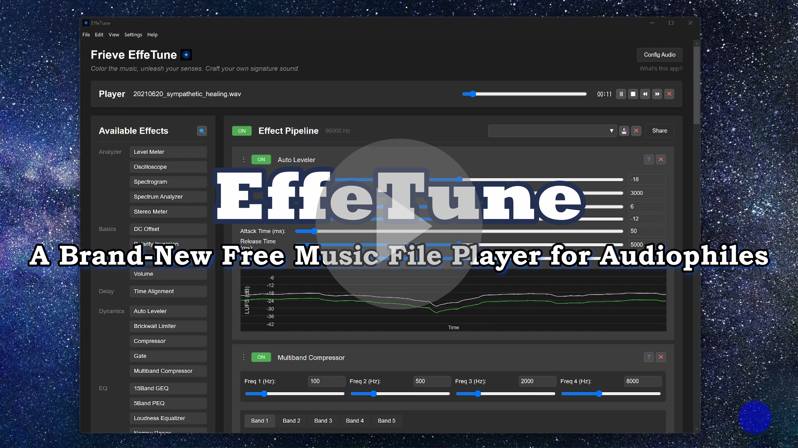

# Frieve EffeTune 

[[中文 (简体)](docs/i18n/zh/README.md)] [[Español](docs/i18n/es/README.md)] [[हिन्दी](docs/i18n/hi/README.md)] [[العربية](docs/i18n/ar/README.md)] [[Português](docs/i18n/pt/README.md)] [[Русский](docs/i18n/ru/README.md)] [[日本語](docs/i18n/ja/README.md)] [[한국어](docs/i18n/ko/README.md)] [[Français](docs/i18n/fr/README.md)]

🔗[**Open Web App**](https://frieve-a.github.io/effetune/effetune.html)  🔗[**Download Desktop App**](https://github.com/Frieve-A/effetune/releases/)

A real-time audio effect processor designed for audio enthusiasts to enhance their music listening experience. EffeTune allows you to process any audio source through various high-quality effects, enabling you to customize and perfect your listening experience in real-time.

## Introduction video

## Concept

EffeTune was created for audio enthusiasts who want to elevate their music listening experience. Whether you're streaming music or playing from physical media, EffeTune lets you add professional-grade effects to customize the sound to your exact preferences. Transform your computer into a powerful audio effects processor that sits between your audio source and your speakers or amplifier.

No audiophile myths, Just pure science.

## Features

- Real-time audio processing
- Drag-and-drop interface for building effect chains
- Expandable effect system with categorized effects
- Live audio visualization
- Audio pipeline that can be modified in real-time
- Offline audio file processing with current effect chain
- Frequency response measurement and correction for system calibration
- Multi-channel processing and output

## Setup Guide

Before using EffeTune, you'll need to set up your audio routing. Here's how to configure different audio sources:

### Music File Player Setup

- Open the EffeTune web app in your browser, or launch the EffeTune desktop app
- Open and play a music file to ensure proper playback
   - Open a music file and select EffeTune as the application (desktop app only)
   - Or select Open music file... from the File menu (desktop app only)
   - Or drag the music file into the window

### Streaming Service Setup

To process audio from streaming services (Spotify, YouTube Music, etc.):

1. Prerequisites:
   - Install a virtual audio device (e.g., VB Cable, Voice Meeter, or ASIO Link Tool)
   - Configure your streaming service to output audio to the virtual audio device

2. Configuration:
   - Open the EffeTune web app in your browser, or launch the EffeTune desktop app
   - Select the virtual audio device as the input source
     - In Chrome, the first time you open it, a dialog box appears asking you to select and allow audio input
     - In the desktop app, set it up by clicking the Config Audio button in the top right of the screen
   - Start playing music from your streaming service
   - Verify that audio is flowing through EffeTune

### Physical Audio Source Setup

To use EffeTune with CD players, network players, or other physical sources:

- Connect your audio interface to your computer
- Open the EffeTune web app in your browser, or launch the EffeTune desktop app
- Select your audio interface as the input and output source
   - In Chrome, the first time you open it, a dialog box appears asking you to select and allow audio input
   - In the desktop app, set it up by clicking the Config Audio button in the top right of the screen
- Your audio interface now functions as a multi-effects processor:
   * Input: Your CD player, network player, or other audio source
   * Processing: Real-time effects through EffeTune
   * Output: Processed audio to your amplifier or speakers

## Usage

### Building Your Effect Chain

1. Available effects are listed on the left side of the screen
   - Use the search button next to "Available Effects" to filter effects
   - Type any text to find effects by name or category
   - Press ESC to clear the search
2. Drag effects from the list to the Effect Pipeline area
3. Effects are processed in order from top to bottom
4. Drag the handle (⋮) or click the ▲▼ buttons to reorder the effects
5. Click an effect's name to expand/collapse its settings
   - Shift+click to collapse/expand all effects except for the Analyzer category
6. Use the ON button to bypass individual effects
7. Click the ? button to open its detailed documentation in a new tab
8. Remove effects using the × button
9. Click the routing button to set the channels to be processed and the input and output busses
   - [More about bus functions](docs/bus-function.md)

### Using Presets

1. Save Your Effect Chain:
   - Set up your desired effect chain and parameters
   - Enter a name for your preset into the input field
   - Click the save button to store it

2. Load a Preset:
   - Type or select a preset name from the dropdown list
   - The preset will be loaded automatically
   - All effects and their settings will be restored

3. Delete a Preset:
   - Select the preset you want to remove
   - Click the delete button
   - Confirm the deletion when prompted

4. Preset Information:
   - Each preset stores your complete effect chain configuration
   - Includes effect order, parameters, and states

### Effect Selection and Keyboard Shortcuts

1. Effect Selection Methods:
   - Click on effect headers to select individual effects
   - Hold Ctrl while clicking to select multiple effects
   - Click on empty space in the Pipeline area to deselect all effects

2. Keyboard Shortcuts:
   - Ctrl + Z: Undo
   - Ctrl + Y: Redo
   - Ctrl + S: Save the current pipeline
   - Ctrl + Shift + S: Save current pipeline as
   - Ctrl + X: Cut selected effects
   - Ctrl + C: Copy selected effects
   - Ctrl + V: Paste effects from clipboard
   - Ctrl + F: Search for effects
   - Ctrl + A: Select all effects in the pipeline
   - Delete: Delete selected effects
   - ESC: Deselect all effects

3. Using Section Features:
   - Add a Section effect at the beginning of a group of effects
   - Enter a descriptive name in the Comment field
   - Toggling the Section ON/OFF will enable/disable all effects within that section
   - Use multiple Section effects to organize your effect chain into logical groups
   - [More about control effects](docs/plugins/control.md)

4. Keyboard Shortcuts (when using the player):
   - Space: Play/Pause
   - Ctrl + → or N: Next track
   - Ctrl + ← or P: Previous track
   - Shift + → or F or .: Fast-forward 10 seconds
   - Shift + ← or B or ,: Rewind 10 seconds
   - Ctrl + T: Toggle Repeat mode
   - Ctrl + H: Toggle Shuffle mode

### Processing Audio Files

1. File Drop or File Specification Area:
   - A dedicated drop area is always visible below the Effect Pipeline
   - Supports single or multiple audio files
   - Files are processed using the current Pipeline settings
   - All processing is done at the Pipeline's sample rate

2. Processing Status:
   - Progress bar shows current processing status
   - Processing time depends on file size and effect chain complexity

3. Download or Save Options:
   - The processed file is output in WAV format
   - Multiple files are automatically packaged in a ZIP file

### Sharing Effect Chains

You can share your effect chain configuration with other users:
1. After setting up your desired effect chain, click the "Share" button in the top-right corner of the Effect Pipeline area
2. The web app URL will be automatically copied to your clipboard
3. Share the copied URL with others - they can recreate your exact effect chain by opening it
4. In the web app, all effect settings are stored in the URL, making them easy to save and share
5. In the desktop app version, export the settings to an effetune_preset file from the File menu
6. Share the exported effetune_preset file. The effetune_preset file can also be loaded by dragging it into the web app window

### Audio Reset

If you experience audio issues (dropouts, glitches):
1. Click the "Reset Audio" button in the top-left corner on the web app or select Reload from the View menu on the desktop app
2. The audio pipeline will be rebuilt automatically
3. Your effect chain configuration will be preserved

### Frequency Response Measurement and Correction

To measure your audio system's frequency response and create a flat correction EQ:
1. For the web version, launch the [Frequency Response Measurement tool](https://frieve-a.github.io/effetune/features/measurement/measurement.html). For the app version, select Frequency Response Measurement from the Settings menu.
2. Follow the guided setup to configure your measurement microphone and output device
3. Measure your system's frequency response at one or more listening positions
4. Generate a parametric EQ correction that can be directly imported into EffeTune
5. Apply the correction to achieve a more accurate, neutral sound reproduction

## Common Effect Combinations

Here are some popular effect combinations to enhance your listening experience:

### Headphone Enhancement
1. Stereo Blend -> RS Reverb
   - Stereo Blend: Adjusts stereo width for comfort (60-100%)
   - RS Reverb: Adds subtle room ambience (10-20% mix)
   - Result: More natural, less fatiguing headphone listening

### Vinyl Simulation
1. Wow Flutter -> Noise Blender -> Saturation
   - Wow Flutter: Adds gentle pitch variation
   - Noise Blender: Creates vinyl-like atmosphere
   - Saturation: Adds analog warmth
   - Result: Authentic vinyl record experience

### FM Radio Style
1. Multiband Compressor -> Stereo Blend
   - Multiband Compressor: Creates that "radio" sound
   - Stereo Blend: Adjusts stereo width for comfort (100-150%)
   - Result: Professional broadcast-like sound

### Lo-Fi Character
1. Bit Crusher -> Simple Jitter -> RS Reverb
   - Bit Crusher: Reduces bit depth for retro feel
   - Simple Jitter: Adds digital imperfections
   - RS Reverb: Creates atmospheric space
   - Result: Classic lo-fi aesthetic

## Troubleshooting

### Audio Issues
1. Dropouts or Glitches
   - Click the "Reset Audio" button in the top-left corner on the web app or select Reload from the View menu on the desktop app to rebuild the audio pipeline
   - Try reducing the number of active effects

2. High CPU Usage
   - Disable effects you're not actively using
   - Consider using fewer effects in your chain

3. Echo Occurs
   - It's likely that your audio inputs and outputs are not configured correctly
   - To process browser audio output, consider installing a dedicated browser solely for EffeTune, or use the desktop app instead.

### Common Setup Issues
1. No Audio Input
   - Verify that audio is playing from a source and outputting to a virtual audio device
   - For the web app version, make sure audio input permissions are allowed in your browser and that the virtual audio device is selected as the input device
   - For the desktop app version, go to Config Audio in the top right corner of the screen and make sure the virtual audio device is selected as the input device

2. Effect Not Working
   - Verify effect is enabled (ON/OFF button)
   - Check parameter settings

3. No Audio Output
   - For the web app version, make sure that the audio output of the OS is set as the output device
   - For the desktop app version, go to "Config Audio" in the top right corner of the screen and make sure the correct output device is selected.

## FAQ

Q. Does this app support surround sound?
A. Currently, due to browser limitations, we cannot handle more than 2 channels in the browser, and there is no proven track record of surround sound operation. While the effect implementation itself supports surround sound, we'll need to wait for future browser support.

Q. What's the recommended effect chain length?
A. While there's no strict limit, we recommend keeping your effect chain to 8-10 effects for optimal performance. More complex chains may impact system performance.

Q. How do I achieve the best sound quality?
A. When possible, use sample rates of 96kHz or higher, begin with subtle effect settings, and gradually build your effect chain. Monitor levels to avoid distortion.

Q. Will this work with any audio source?
A. Yes, EffeTune can process any audio playing through your selected input device, including streaming services, local files, and physical media.

## Available Effects

| Category | Effect | Description | Documentation |
|-----------|--------|-------------|---------------|
| Analyzer  | Level Meter | Displays audio level with peak hold | [Details](docs/plugins/analyzer.md#level-meter) |
| Analyzer  | Oscilloscope | Real-time waveform visualization | [Details](docs/plugins/analyzer.md#oscilloscope) |
| Analyzer  | Spectrogram | Shows frequency spectrum changes over time | [Details](docs/plugins/analyzer.md#spectrogram) |
| Analyzer  | Spectrum Analyzer | Real-time spectrum analysis | [Details](docs/plugins/analyzer.md#spectrum-analyzer) |
| Analyzer  | Stereo Meter | Visualizes stereo balance and sound movement | [Details](docs/plugins/analyzer.md#stereo-meter) |
| Basics    | Channel Divider | Splits stereo signal into frequency bands and routes to separate channels | [Details](docs/plugins/basics.md#channel-divider) |
| Basics    | DC Offset | DC offset adjustment | [Details](docs/plugins/basics.md#dc-offset) |
| Basics    | Matrix | Routes and mixes audio channels with flexible control | [Details](docs/plugins/basics.md#matrix) |
| Basics    | MultiChannel Panel | Control panel for multiple channels with volume, mute, solo and delay | [Details](docs/plugins/basics.md#multichannel-panel) |
| Basics    | Mute | Completely silences the audio signal | [Details](docs/plugins/basics.md#mute) |
| Basics    | Polarity Inversion | Signal polarity inversion | [Details](docs/plugins/basics.md#polarity-inversion) |
| Basics    | Stereo Balance | Stereo channel balance control | [Details](docs/plugins/basics.md#stereo-balance) |
| Basics    | Volume | Basic volume control | [Details](docs/plugins/basics.md#volume) |
| Delay     | Delay          | Standard delay effect                                   | [Details](docs/plugins/delay.md#delay) |
| Delay     | Time Alignment | Fine-tuning timing adjustments for audio channels | [Details](docs/plugins/delay.md#time-alignment) |
| Dynamics  | Auto Leveler | Automatic volume adjustment based on LUFS measurement for consistent listening experience | [Details](docs/plugins/dynamics.md#auto-leveler) |
| Dynamics  | Brickwall Limiter | Transparent peak control for safe and comfortable listening | [Details](docs/plugins/dynamics.md#brickwall-limiter) |
| Dynamics  | Compressor | Dynamic range compression with threshold, ratio, and knee control | [Details](docs/plugins/dynamics.md#compressor) |
| Dynamics  | Gate | Noise gate with threshold, ratio, and knee control for noise reduction | [Details](docs/plugins/dynamics.md#gate) |
| Dynamics  | Multiband Compressor | Professional 5-band dynamics processor with FM radio-style sound shaping | [Details](docs/plugins/dynamics.md#multiband-compressor) |
| EQ        | 15Band GEQ | 15-band graphic equalizer | [Details](docs/plugins/eq.md#15band-geq) |
| EQ        | 5Band PEQ | Professional parametric equalizer with 5 fully configurable bands | [Details](docs/plugins/eq.md#5band-peq) |
| EQ        | Five Band Dynamic EQ | 5-band dynamic equalizer with threshold-based frequency adjustment | [Details](docs/plugins/eq.md#five-band-dynamic-eq) |
| EQ        | Hi Pass Filter | Remove unwanted low frequencies with precision | [Details](docs/plugins/eq.md#hi-pass-filter) |
| EQ        | Lo Pass Filter | Remove unwanted high frequencies with precision | [Details](docs/plugins/eq.md#lo-pass-filter) |
| EQ        | Loudness Equalizer | Frequency balance correction for low-volume listening | [Details](docs/plugins/eq.md#loudness-equalizer) |
| EQ        | Narrow Range | Combination of high-pass and low-pass filters | [Details](docs/plugins/eq.md#narrow-range) |
| EQ        | Tilt EQ      | Tilt equalizer for quick tone shaping | [Details](docs/plugins/eq.md#tilt-eq)      |
| EQ        | Tone Control | Three-band tone control | [Details](docs/plugins/eq.md#tone-control) |
| Lo-Fi     | Bit Crusher | Bit depth reduction and zero-order hold effect | [Details](docs/plugins/lofi.md#bit-crusher) |
| Lo-Fi     | Noise Blender | Noise generation and mixing | [Details](docs/plugins/lofi.md#noise-blender) |
| Lo-Fi     | Simple Jitter | Digital jitter simulation | [Details](docs/plugins/lofi.md#simple-jitter) |
| Modulation | Doppler Distortion | Simulates natural, dynamic changes in sound caused by subtle speaker cone movements | [Details](docs/plugins/modulation.md#doppler-distortion) |
| Modulation | Pitch Shifter | Lightweight pitch shifting effect | [Details](docs/plugins/modulation.md#pitch-shifter) |
| Modulation | Tremolo | Volume-based modulation effect | [Details](docs/plugins/modulation.md#tremolo) |
| Modulation | Wow Flutter | Time-based modulation effect | [Details](docs/plugins/modulation.md#wow-flutter) |
| Resonator | Horn Resonator | Horn resonance simulation with customizable dimensions | [Details](docs/plugins/resonator.md#horn-resonator) |
| Resonator | Modal Resonator | Frequency resonance effect with up to 5 resonators | [Details](docs/plugins/resonator.md#modal-resonator) |
| Reverb    | RS Reverb | Random scattering reverb with natural diffusion | [Details](docs/plugins/reverb.md#rs-reverb) |
| Saturation| Hard Clipping | Digital hard clipping effect | [Details](docs/plugins/saturation.md#hard-clipping) |
| Saturation | Harmonic Distortion | Adds unique character through harmonic distortion with independent control of each harmonic | [Details](docs/plugins/saturation.md#harmonic-distortion) |
| Saturation| Multiband Saturation | 3-band saturation effect for precise frequency-based warmth | [Details](docs/plugins/saturation.md#multiband-saturation) |
| Saturation| Saturation | Saturation effect | [Details](docs/plugins/saturation.md#saturation) |
| Saturation| Sub Synth | Mixes in subharmonic signals for bass enhancement | [Details](docs/plugins/saturation.md#sub-synth) |
| Spatial   | MS Matrix | Mid-side encoding and decoding for stereo manipulation | [Details](docs/plugins/spatial.md#ms-matrix) |
| Spatial   | Multiband Balance | 5-band frequency-dependent stereo balance control | [Details](docs/plugins/spatial.md#multiband-balance) |
| Spatial   | Stereo Blend | Stereo width control effect | [Details](docs/plugins/spatial.md#stereo-blend) |
| Others    | Oscillator | Multi-waveform audio signal generator | [Details](docs/plugins/others.md#oscillator) |
| Control   | Section | Group multiple effects for unified control | [Details](docs/plugins/control.md) |

## Technical Information

### Browser Compatibility

Frieve EffeTune has been tested and verified to work on Google Chrome. The application requires a modern browser with support for:
- Web Audio API
- Audio Worklet
- getUserMedia API
- Drag and Drop API

### Browser Support Details
1. Chrome/Chromium
   - Fully supported and recommended
   - Update to latest version for best performance

2. Firefox/Safari
   - Limited support
   - Some features may not work as expected
   - Consider using Chrome for best experience

### Recommended Sample Rate

For optimal performance with nonlinear effects, it is recommended to use EffeTune at a sample rate of 96kHz or higher. This higher sample rate helps achieve ideal characteristics when processing audio through nonlinear effects such as saturation and compression.

## Development Guide

Want to create your own audio plugins? Check out our [Plugin Development Guide](docs/plugin-development.md).
Want to build a desktop app? Check out our [Build Guide](build.md).

## Links

[Version History](docs/version-history.md)

[Source Code](https://github.com/Frieve-A/effetune)

[YouTube](https://www.youtube.com/@frieveamusic)
