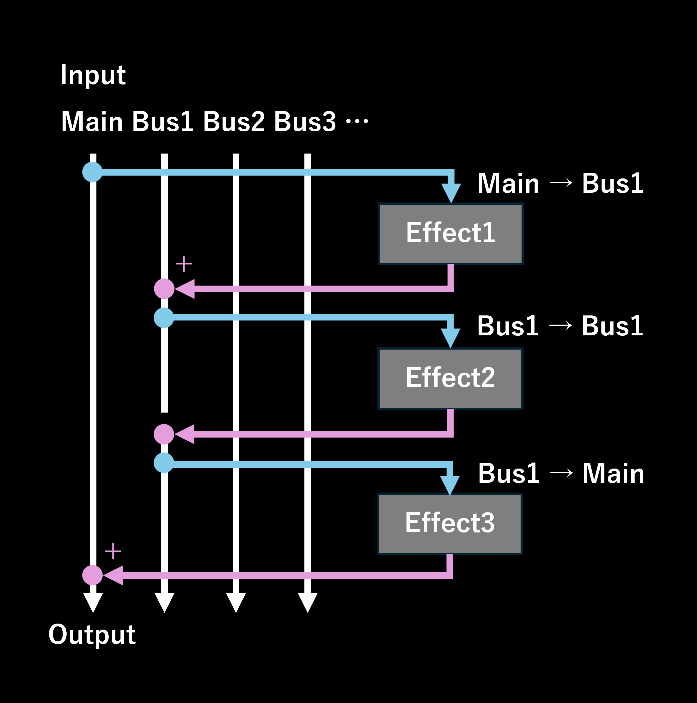

# バス機能の使い方

バス機能により、エフェクト間で柔軟なオーディオルーティングが可能となり、より複雑で多彩なオーディオ処理が実現します。

## 基本概念

- 各エフェクトは、処理されるオーディオ信号を受け取る **Input Bus**（入力バス）と、処理後のオーディオを出力する **Output Bus**（出力バス）を指定できます。
- 特に指定がなければ、各エフェクトはデフォルトで **Main bus**（メインバス）を入力および出力に使用します。
- 最大で4つの追加バス（**Bus 1 から Bus 4**）を使用することができます。

## エフェクトの入力および出力バスの設定

- 各エフェクトに表示されている上下ボタンの左側にある **Routing button**（ルーティングボタン）をクリックします。
- ルーティングボタンをクリックすると、設定ダイアログが開き、MainまたはBus 1からBus 4までの中から自由に入力バスと出力バスを選択できます。
- 変更は即座に反映されます。
- ダイアログを閉じるには、右上の×ボタンをクリックするか、ダイアログの外側をクリックします。

- 入力または出力のいずれかがBus 1以上に設定されている場合、ルーティングボタンの横に「Bus X→Bus Y」と表示されます。
  - 例：Bus 2からオーディオを処理し、Bus 3へ出力する場合、「Bus 2→Bus 3」と表示されます。

## オーディオ処理の仕組み

- エフェクトは上から下へと順番に処理されます。
- 各エフェクトは、指定された入力バスからオーディオ信号を受け取り、処理した結果を出力バスに送ります。
- 入力バスが初めて使用される場合、処理は無音状態から開始されます。
- 入力バスと出力バスが同じ場合、出力バスのオーディオは処理結果によって上書きされます。
- 異なるバスが指定されている場合、処理済みのオーディオが出力バスに追加されます。
- 最終的に、オーディオの再生は常に **Main bus** から行われます。

[← READMEに戻る](README.md)
