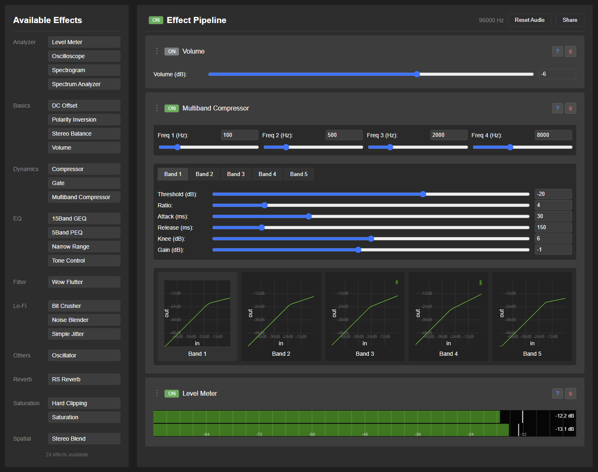

# Frieve EffeTune 

[アプリを開く](https://frieve-a.github.io/effetune/effetune.html)

音楽愛好家向けのウェブベースのリアルタイムオーディオエフェクトプロセッサーです。EffeTuneを使用することで、あらゆる音源に様々な高品質なエフェクトをかけることができ、リアルタイムで音楽体験をカスタマイズし、完璧なサウンドを実現することができます。

## コンセプト

EffeTuneは、音楽体験をより深いレベルで楽しみたい音楽愛好家のために作られました。ストリーミング音楽や物理メディアからの再生など、音源を問わず、プロフェッショナルグレードのエフェクトを追加して、好みのサウンドに調整することができます。お使いのコンピュータを、音源とスピーカーやアンプの間に位置する強力なオーディオエフェクトプロセッサーに変えることができます。

オカルトではなく、純粋な科学に基づいたソフトです。

## 特徴

- リアルタイムオーディオ処理
- ドラッグ&ドロップでエフェクトチェーンを構築
- カテゴリー別のエフェクトを備えた拡張可能なプラグインシステム
- リアルタイムオーディオ可視化
- リアルタイムで変更可能なオーディオパイプライン

## セットアップガイド

EffeTuneを使用する前に、オーディオルーティングの設定が必要です。音源別の設定方法は以下の通りです:

### ストリーミングサービスの設定

ストリーミングサービス(Spotify、YouTube Musicなど)の音声を処理するには:

1. 前提条件:
   - 仮想オーディオデバイス(VB Cable、Voice Meeter、ASIO Link Toolなど)をインストール
   - ストリーミングサービスの出力を仮想オーディオデバイスに設定

2. 設定:
   - EffeTuneを起動
   - 入力ソースとして仮想オーディオデバイスを選択
   - ストリーミングサービスで音楽を再生
   - EffeTuneで音声が流れていることを確認
   - エフェクトをパイプラインに追加して音楽体験を向上

### 物理音源の設定

CDプレーヤー、ネットワークプレーヤー、その他の物理音源でEffeTuneを使用するには:

1. 設定:
   - オーディオインターフェースをコンピュータに接続
   - EffeTuneを起動
   - 入力ソースとしてオーディオインターフェースを選択
   - ブラウザの音声出力をオーディオインターフェースに設定
   - オーディオインターフェースがマルチエフェクトプロセッサーとして機能:
     * 入力:CDプレーヤー、ネットワークプレーヤー、その他の音源
     * 処理:EffeTuneによるリアルタイムエフェクト
     * 出力:アンプやスピーカーへの処理済み音声

## 使用方法

### エフェクトチェーンの構築

1. 画面左側に利用可能なプラグインが一覧表示
2. プラグインをリストからエフェクトパイプラインエリアにドラッグ
3. プラグインは上から下の順に処理
4. ハンドル(⋮)をドラッグしてプラグインの順序を変更
5. プラグイン名をクリックして設定パネルの展開/折りたたみ
6. ON/OFFボタンで個別のエフェクトをバイパス
7. ゴミ箱アイコンでプラグインを削除

### プリセットの使用

1. エフェクトチェーンの保存:
   - エフェクトチェーンとパラメータを設定
   - プリセット入力欄に名前を入力
   - 保存ボタンをクリックしてプリセットを保存

2. プリセットの読み込み:
   - ドロップダウンリストからプリセット名を選択または入力
   - プリセットが自動的に読み込まれます
   - すべてのプラグインと設定が復元されます

3. プリセットの削除:
   - 削除したいプリセットを選択
   - 削除ボタンをクリック
   - 確認プロンプトで削除を承認

4. プリセット情報:
   - エフェクトチェーンの設定を完全に保存
   - プラグインの順序、パラメータ、状態を含む

### プラグインの選択とキーボードショートカット

1. プラグインの選択方法:
   - プラグインのヘッダーをクリックして個別に選択
   - Ctrlを押しながらクリックで複数選択
   - パイプラインエリアの空白部分をクリックで全選択解除

2. キーボードショートカット:
   - Ctrl + A:パイプライン内のすべてのプラグインを選択
   - Ctrl + C:選択したプラグインをコピー
   - Ctrl + V:クリップボードからプラグインを貼り付け
   - ESC:全選択解除

3. プラグインのドキュメント:
   - プラグインの?ボタンをクリックすると、詳細なドキュメントが新しいタブで開きます

### エフェクトチェーンの共有

エフェクトチェーンの設定を他のユーザーと共有できます:
1. エフェクトチェーンを設定後、エフェクトパイプラインエリアの右上にある「共有」ボタンをクリック
2. URLが自動的にクリップボードにコピー
3. コピーしたURLを他のユーザーと共有 - 同じエフェクトチェーンを正確に再現できます
4. すべてのエフェクト設定がURLに保存され、簡単に保存・共有が可能

### オーディオのリセット

音声の問題(途切れ、グリッチ)が発生した場合:
1. 左上の「オーディオをリセット」ボタンをクリック
2. オーディオパイプラインが自動的に再構築
3. エフェクトチェーンの設定は保持

## よく使われるエフェクトの組み合わせ

音楽体験を向上させるための人気のエフェクトの組み合わせをご紹介します:

### ヘッドホン音質向上
1. Stereo Blend -> RS Reverb
   - Stereo Blend:快適な聴取のためにステレオ幅を調整(90-110%)
   - RS Reverb:微妙な空間の広がりを追加(ミックス10-20%)
   - 効果:より自然で疲れにくいヘッドホン再生

### アナログレコード風
1. Wow Flutter -> Noise Blender -> Simple Tube
   - Wow Flutter:緩やかなピッチ変動を追加
   - Noise Blender:レコードらしい雰囲気を演出
   - Simple Tube:アナログ的な温かみを追加
   - 効果:本物のレコード再生のような体験

### FMラジオ風
1. Multiband Compressor -> 5Band PEQ -> Hard Clipping
   - Multiband Compressor:ラジオらしいサウンドを作成
   - 5Band PEQ:存在感と明瞭度を向上
   - Hard Clipping:微妙な温かみを追加
   - 効果:プロフェッショナルな放送局のような音質

### Lo-Fi風
1. Bit Crusher -> Simple Jitter -> RS Reverb
   - Bit Crusher:レトロな雰囲気のためにビット深度を低下
   - Simple Jitter:デジタル的な揺らぎを追加
   - RS Reverb:空間的な広がりを作成
   - 効果:クラシックなlo-fiサウンド

## トラブルシューティング

### 音声の問題
1. 音声の途切れやグリッチ
   - 「オーディオをリセット」をクリックしてパイプラインを再構築
   - アクティブなエフェクトの数を減らしてみる
   - 音声を使用している他のブラウザタブを閉じる

2. CPU使用率が高い
   - 使用していないエフェクトを無効化
   - エフェクトチェーンの数を減らすことを検討

### 一般的な設定の問題
1. 音声入力がない
   - ブラウザの入力デバイス選択を確認
   - ブラウザのマイク権限を確認
   - 音源からの音声再生を確認

2. エフェクトが機能しない
   - エフェクトが有効になっているか確認(ON/OFFボタン)
   - パラメータ設定を確認
   - エフェクトを削除して再追加してみる

3. 共有の問題
   - 「共有」ボタンを使用してURLを生成
   - URLを完全にコピー
   - 新しいブラウザウィンドウで共有リンクをテスト

## よくある質問

Q. サラウンドサウンドに対応していますか?
A. 現在、ブラウザの制限により2チャンネル以上の処理ができず、サラウンドサウンドの動作実績もありません。プラグインの実装自体はサラウンドサウンドに対応していますが、ブラウザの対応を待つ必要があります。

Q. 推奨されるエフェクトチェーンの長さは?
A. 厳密な制限はありませんが、最適なパフォーマンスのために8-10個のエフェクトを推奨します。より複雑なチェーンはシステムのパフォーマンスに影響を与える可能性があります。

Q. お気に入りのエフェクトの組み合わせを保存できますか?
A. はい!「共有」ボタンを使用してエフェクトチェーン全体の設定を含むURLを生成し、ブックマークに保存できます。

Q. 最高の音質を得るにはどうすればよいですか?
A. 可能な場合は96kHz以上のサンプルレートを使用し、控えめなエフェクト設定から始めて、徐々にチェーンを構築します。歪みを避けるためにレベルを監視してください。

Q. どんな音源でも使用できますか?
A. はい、選択した入力デバイスを通じて再生される音声であれば、ストリーミングサービス、ローカルファイル、物理メディアなど、あらゆる音源を処理できます。

## 利用可能なエフェクト

| カテゴリー | エフェクト | 説明 | ドキュメント |
|----------|--------|-------------|---------------|
| Analyzer | Level Meter | ピークホールド付きオーディオレベル表示 | [詳細](plugins/analyzer.md#level-meter) |
| Analyzer | Oscilloscope | リアルタイム波形表示 | [詳細](plugins/analyzer.md#oscilloscope) |
| Analyzer | Spectrogram | 周波数スペクトルの時間変化表示 | [詳細](plugins/analyzer.md#spectrogram) |
| Analyzer | Spectrum Analyzer | リアルタイムスペクトル分析 | [詳細](plugins/analyzer.md#spectrum-analyzer) |
| Basics | DC Offset | DCオフセット調整 | [詳細](plugins/basics.md#dc-offset) |
| Basics | Polarity Inversion | 信号極性反転 | [詳細](plugins/basics.md#polarity-inversion) |
| Basics | Stereo Balance | ステレオチャンネルバランス制御 | [詳細](plugins/basics.md#stereo-balance) |
| Basics | Volume | 基本的な音量制御 | [詳細](plugins/basics.md#volume) |
| Dynamics | Compressor | スレッショルド、レシオ、ニー制御付きダイナミックレンジ圧縮 | [詳細](plugins/dynamics.md#compressor) |
| Dynamics | Gate | ノイズ低減のためのスレッショルド、レシオ、ニー制御付きノイズゲート | [詳細](plugins/dynamics.md#gate) |
| Dynamics | Multiband Compressor | FMラジオ風のサウンドシェイピングが可能なプロフェッショナルな5バンドダイナミクスプロセッサー | [詳細](plugins/dynamics.md#multiband-compressor) |
| EQ | 15Band GEQ | 15バンドグラフィックイコライザー | [詳細](plugins/eq.md#15band-geq) |
| EQ | 5Band PEQ | 5つの完全設定可能なバンドを持つプロフェッショナルなパラメトリックイコライザー | [詳細](plugins/eq.md#5band-peq) |
| EQ | Narrow Range | ハイパスとローパスフィルターの組み合わせ | [詳細](plugins/eq.md#narrow-range) |
| EQ | Tone Control | 3バンドトーンコントロール | [詳細](plugins/eq.md#tone-control) |
| Filter | Wow Flutter | 時間ベースのモジュレーションエフェクト | [詳細](plugins/filter.md#wow-flutter) |
| Lo-Fi | Bit Crusher | ビット深度削減とゼロ次ホールドエフェクト | [詳細](plugins/lofi.md#bit-crusher) |
| Lo-Fi | Noise Blender | ノイズ生成とミキシング | [詳細](plugins/lofi.md#noise-blender) |
| Lo-Fi | Simple Jitter | デジタルジッター再現 | [詳細](plugins/lofi.md#simple-jitter) |
| Reverb | RS Reverb | 自然な拡散を持つランダムスキャッタリングリバーブ | [詳細](plugins/reverb.md#rs-reverb) |
| Saturation | Hard Clipping | デジタルハードクリッピングエフェクト | [詳細](plugins/saturation.md#hard-clipping) |
| Saturation | Saturation | サチュレーションエフェクト | [詳細](plugins/saturation.md#saturation) |
| Spatial | Stereo Blend | ステレオ幅制御エフェクト | [詳細](plugins/spatial.md#stereo-blend) |
| Others | Oscillator | マルチ波形オーディオ信号ジェネレーター | [詳細](plugins/others.md#oscillator) |

## 技術情報

### ブラウザ互換性

Frieve EffeTuneはGoogle Chromeでテストおよび動作確認されています。アプリケーションには以下をサポートする最新のブラウザが必要です:
- Web Audio API
- Audio Worklet
- getUserMedia API
- Drag and Drop API

### ブラウザサポートの詳細
1. Chrome/Chromium
   - 完全サポートおよび推奨
   - 最高のパフォーマンスのために最新バージョンに更新

2. Firefox/Safari
   - 限定的なサポート
   - 一部の機能が期待通りに動作しない可能性
   - 最適な体験のためにChromeの使用を推奨

### 推奨サンプルレート

非線形エフェクトの最適なパフォーマンスのために、96kHz以上のサンプルレートでEffeTuneを使用することを推奨します。このより高いサンプルレートは、サチュレーションやコンプレッションなどの非線形エフェクトを処理する際に理想的な特性を実現するのに役立ちます。

## プラグイン開発

独自のオーディオプラグインを作成したい場合は、[プラグイン開発ガイド](plugin-development.md)をご覧ください。

## バージョン履歴

### バージョン1.00(2025年2月8日)
- 処理効率の改善
- その他の細かな改善

### バージョン0.50(2025年2月7日)
- エフェクトチェーン設定の保存と読み込みを行うプリセット機能を追加
- 使用説明書が以下の言語で利用可能になりました:中文 (简体)、Español、हिन्दी、العربية、Português、Русский、日本語、한国어、Français
- 様々な細かい改善

### バージョン0.30(2025年2月5日)
- 処理効率の改善
- プラグイン選択とキーボードショートカット(Ctrl+A、Ctrl+C、Ctrl+V)の追加
- リアルタイム波形表示のためのOscilloscopeプラグインの追加
- 様々な細かい改善

### バージョン0.10(2025年2月3日)
- タッチ操作のサポート追加
- 処理効率の改善
- 重い処理タスクの最適化
- 音声の途切れの低減
- 様々な細かい改善

### バージョン0.01(2025年2月2日)
- 初回リリース

## リンク

[ソースコード](https://github.com/Frieve-A/effetune)

[YouTube](https://www.youtube.com/@frieveamusic)
